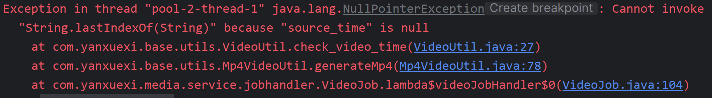

## 解决问题

1. 项目yanxuexi-content-api中bootstrap.yml一直不生效，修改为application.yml，可以生效，网上搜索得到解决方案，缺乏spring-cloud-starter-bootstrap依赖，引入后得以解决。[参考链接](https://blog.csdn.net/qq_34871626/article/details/112887269)

### 开发环境配置

#### 远程连接虚拟机

使用ssh客户端工具FinalShell远程 连接 虚拟机中的CentOS系统。

IP地址：192.168.101.65

账号与密码为：root/centos

执行 **systemctl start docker** 启动docker。

运行： **sh /data/soft/restart.sh**  

查询docker容器：docker ps

### Day2 内容

#### 7/14

新增数据字典表，将具有固定值的字段映射为 code ，如审核状态，方便对字段值做修改；

三种跨域方案

添加跨域过滤器，解决跨域问题 （跨域过滤器是如何生效的？过滤器是在什么时候被调用的？底层原理是？）

**4.3.1 树型表查询** 	表自连接	with recursive 递归执行 sql 语句 

Day2-10

#### 7/15

Day2-11 **树型表查询方法**：遍历树节点查询返回结果，将子节点添加到父节点的子集和中（用Map存储树节点查询返回结果，以便根据当前节点的父节点ID取到其父节点）

#### 7/16
##### Day2-13 
RuntimeException 和 Exception 处理方式的区别是什么？ Exception 需要方法写上 Throws，那 RuntimeException 是如何处理的呢？
方法内部调用会使事务失效吗？为什么？
##### Day2-14

#### 7/17
##### Day2-15
**Mybatis 分页插件原理？**
ThreadLocal 存放分页参数，拦截SQL语句，先查询记录总数，再计算实际分页参数，在MySQL中将实际分页参数添加到SQL语句limit后，然后执行SQL语句。

**树型表的标记字段是什么？如何查询MySQL属性表？**
parentId。
表的自连接（适用于固定层级）；MySQL递归查询（适用于任何层级，较为灵活）

**#{}和${}的区别？**
#{}占位符；${}SQL拼接，有SQL注入的风险。

#### Day2 16-18
**项目中是如何处理异常的？**
使用基于AOP实现的控制器增强注解@ControllerAdvice和异常处理注解@ExceptionHandler来实现。

**控制器增强注解@ControllerAdvice和异常处理注解@ExceptionHandler的底层原理是？**
。。。

#### 7/19
##### Day3 01-02
**JSR 303校验**
JSR-303，全称为Java Specification Request 303，是一种用于**后端参数校验的规范**。它提供了一套注解和校验器，用于在Java应用程序的后端进行数据验证
常见的实现有Hibernate Validator和Apache Bean Validation
**分组校验**
有时候在同一个属性上设置一个校验规则不能满足要求，比如：订单编号由系统生成，在添加订单时要求订单编号为空，在更新订单时要求订单编写不能为空。此时就用到了分组校验，同一个属性定义多个属于不同分组的校验规则。

#### 7/20
#### Day3 03-05
修改课程接口开发

#### Day3 06-10
课程计划增删改接口
使用 Join 进行联合查询时，返回结果可以通过 ResultMap 中的 collection 标签进行一对多映射和 association 标签进行一对一映射。

#### Day4 项目实战
1. 课程计划删除
2. **课程计划排序**，交换两个节点的排序字段值
3. 师资管理接口开发
4. 删除课程，连带删除课程计划、课程教师、课程营销信息

### 7/27
#### Day5 01-09
1. Nacos 服务注册和服务配置
2. 网关配置
3. 搭建媒资服务工程

#### Day5 10-11
**MinIO**
MinIO集群采用去中心化共享架构，每个结点是对等关系，通过Nginx可对MinIO进行负载均衡访问。
Minio使用纠删码技术来保护数据，它是一种恢复丢失和损坏数据的数学算法 ,使用纠删码的好处是即便丢失一半数量（N/2）的硬盘，仍然可以恢复数据。

### 7/28
#### Day5 12 - 15
上传图片接口开发，使用MinIo提供的SDK可以方便的实现文件上传功能
上传图片的同时，将图片的相关信息存入数据库（包括文件在MinIo文件系统上的访问地址）

#### Day5 16
启动 system 服务后，会注册 system-service 服务，而不是 system-api 服务，而且 system 启动后并未成功读取到配置信息，启动端口为默认的8080。删除 system-service 下 target 文件夹下面的application.yml文件后可以正常运行。
原因：之前编译的文件残留有配置信息，导致报错。

#### Day5 17
解决同一个类中，方法互相调用时，事务注解失效的问题。
解决方案：注入自身的代理对象（注入时加上@Lazy懒加载注解解决循环依赖问题）

### 8/2
#### Day6 01-02
RandomAccessFile 既可以读取文件内容，也可以向文件输出数据。同时，RandomAccessFile 支持“随机访问”的方式，程序快可以直接跳转到文件的任意地方来读写数据。
RandomAccessFile 的一个重要使用场景就是网络请求中的多线程下载及断点续传。

### 8/3
#### Day6 03-06
文件分块上传
前端分块 -> 校验文件是否存在 -> 校验分块是否存在 -> 上传分块 -> 合并分块 -> 校验上传的文件是否和原文件一致 -> 文件信息入库 -> 删除分块
现在卡在了校验上传的文件是否和原文件一致的地方，从minio下载合并后的文件的md5值与原文件的md5值不一致，暂时无法解决，去掉了校验，后面有时间再添加

### 8/10
#### Day6 07-08
面试题
1. 什么时候事务会失效？
2. 事务的传播行为有哪些？
3. 断点续传是怎么做的？

待做任务
1. 断点续传时分块文件可能成为垃圾，需要定时清理

#### Day6 09-14
**视频文件格式和编码方式的区别？**
视频文件格式一般情况下从视频文件的后缀名就能看出来，比如AVI,Mp4,3gp,mov，rmvb等等。这些格式又叫做**容器格式**（container format），顾名思义就是用来装东西的，你可以把它想象成为一个便当盒，
通常我们从网上下载的电影都是有声音的，所以容器格式中一般至少包含有两个数据流（stream），一个视频流，一个音频流，就好比是一个便当盒里装着的配菜和米饭。
视频编码方式则是指**容器格式中视频流数据的压缩编码方式**，例如Mpeg-4，H.264，H.263，等等。而视频数据采用了何种编码方式是无法单单从文件格式的后缀上看出来的。就是说你无法从一个盖着盖子的便当盒外面看出里面装了什么配菜。

**如何高效处理一批任务？**
分布式加多线程，充分利用多台计算机，每台计算机使用多线程处理。

**任务调度**
是指系统为了完成特定业务，基于给定时间点、给定时间间隔或者给定执行次数自动执行任务，例如：定时任务调度、延时任务调度等。

**分布式任务调度**
通常任务调度的程序是集成在服务中的，由于采用分布式架构，一个服务往往会部署多个实例来运行我们的业务，在这种分布式系统环境下运行任务调度，称之为分布式任务调度。

**xxl-job介绍**
XXL-JOB是一个轻量级分布式任务调度平台，XXL-JOB主要有调度中心、执行器、任务。
调度中心：
负责管理调度信息，按照调度配置发出调度请求，自身不承担业务代码；主要职责为执行器管理、任务管理、监控运维、日志管理等
任务执行器：
负责接收调度请求并执行任务逻辑；主要职责是注册服务、任务执行服务（接收到任务后会放入线程池中的任务队列）、执行结果上报、日志服务等
任务：负责执行具体的业务处理。
执行流程：
1. 任务执行器根据配置的调度中心的地址，自动注册到调度中心
2. 达到任务触发条件，调度中心下发任务
3. 执行器基于线程池执行任务，并把执行结果放入内存队列中、把执行日志写入日志文件中
4. 执行器消费内存队列中的执行结果，**主动上报给调度中心**
5. 当用户在调度中心查看任务日志，调度中心请求任务执行器，任务执行器读取任务日志文件并返回日志详情

**疑问**
- 下面这个流程是正确的吗？
现有一个API工程依赖于service工程，API工程启动后，service工程也会启动，会读取自身的配置文件等。
- 为什么微服务启动端口和注册到xxl调度中心的端口是不同的，难道开启了两个进程运行同一个服务？

**任务幂等性**
幂等性指的是一个操作无论执行多少次，效果相同。
任务的幂等性是指：对于数据的操作无论多少次，操作的结果始终是一致的。在当前项目中要实现的是无论多少次任务调度同一个视频只执行一次成功的转码。

### Day7 01-02


### Day7 03-06 视频处理
**分布式锁**
多个虚拟机之间需要使用锁来进行同步时，不能使用Java提供的锁机制，而要用分布式锁。
分布式锁不属于某个虚拟机，而是分布式部署，由多个虚拟机共享。
分布式锁由一个单独的程序提供加锁、解锁服务。

**分布式锁实现方式**
- 基于数据库实现
- 基于Redis实现
- 基于ZooKeeper实现

**本项目采用基于数据库的分布式锁实现方式**
这是一种乐观锁。
```
update media_process set status = 4 where id = #{id} and (status = 1 or status = 3) and fail_count < 3;
```
上面的sql语句哪个虚拟机执行成功，哪个就获取到了锁，其中status=4代表此任务在处理中。
疑问和重点：
- **乐观锁和悲观锁的定义？**
- 这里为什么要用分布式锁，一定要理解清楚，是因为可能某个任务执行器网络出现了问题，其任务被调度中心分配给其他执行器，这样就会导致任务被多次执行，因此需要使用分布式锁



### Day7 07
任务处理-面试
1. xxl-job的工作原理是什么？xxl-job是怎么工作的？
2. 如何保证任务不重复执行？
3. 任务的幂等性如何保证？

