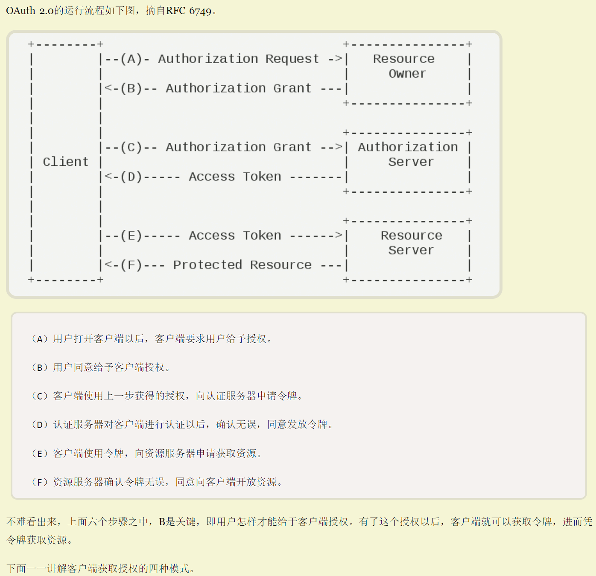

### Day09
#### 05-06
**SpringCloudSecurity与Swagger冲突**
新增spring-boot-actuator-autoconfigure依赖，在SpringCloudSecurity中排除spring-boot-starter-webflux依赖

**OAuth2协议**

https://www.ruanyifeng.com/blog/2014/05/oauth_2_0.html

### Day10
#### 1-10 用户认证（密码模式）

#### 11-14 微信扫码登录
